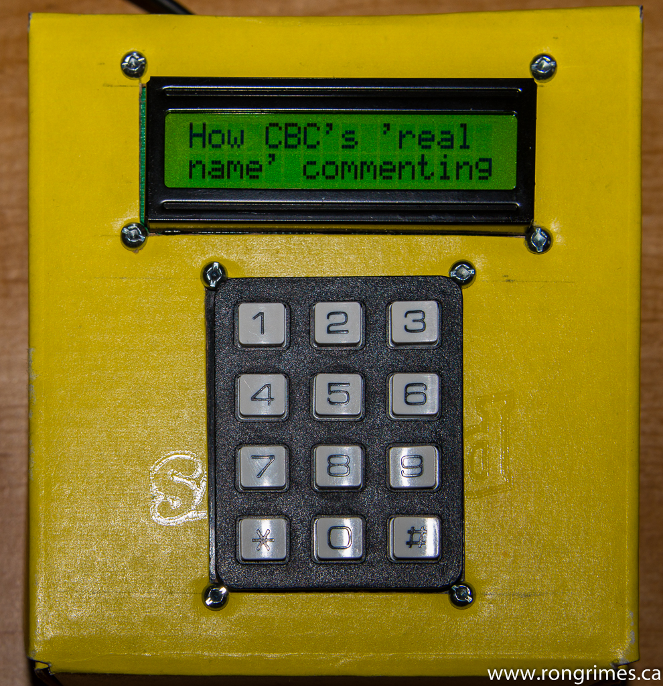
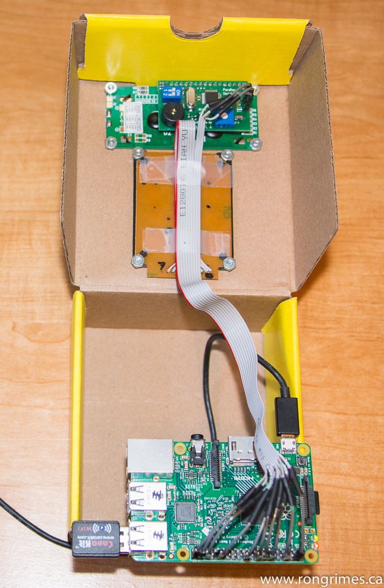
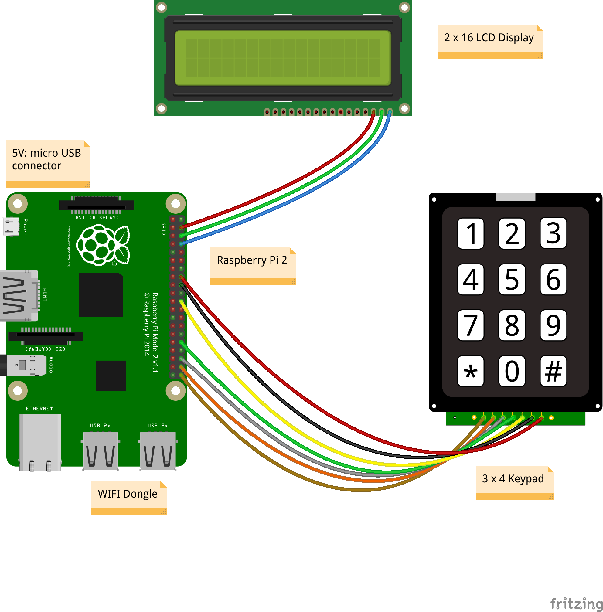

# The Chocolate Box News Reader

**Project Name**: paxnews

<table>
<tr>
    <td valign="top">  </td>
    <td>  </td>
    </tr>
</table>

##What does it do
The Chocolate Box News Reader (CBNR) continuously displays news from the [CBC](https://en.wikipedia.org/wiki/Canadian_Broadcasting_Corporation) [RSS](https://en.wikipedia.org/wiki/RSS) feeds.

##Features:
  * 29 news feeds - Top Stories, World, and Canada Regional
  * 15 news items per feed
  * It takes about 90 minutes to cycle through the full news set
  * Each news item has "more" information that can be displayed on request.
  * Will run offline with stored news
  * Can run on continuous power (current uptime is 8 weeks 4 days)
  * Even with only the dumb keypad & 2x16 display, it can connect to a local wifi access point, with password, or web login
  
##Reason for Building
"_Worst case of scope creep I've ever seen._"  
-Ron Grimes  
 February 1, 2017
 
It started with a Raspberry Pi and the dumb 4x3 keypad, and a question: "I wonder if I can drive the keypad?"
Well, Yes, after some tries, and some inspirational code from GitHub (I hope to give credit if/when I
find the original source again).
 
Same thing with the 2x16 Parallax display unit: "I wonder if I can drive that too?". Well, Yes.
 
Next question: "Um, what to display?" A stock ticker is boring (well, to me, anyway), and I wanted something that was changing
steadily - not too fast, or slow. So, _**News**_ was the answer, and I'd found the CBC RSS feed sometime
in my travels on the Interwebs.

And from there the project grew... and grew...
  
  
Other questions to me (and answers):
  * How do I parse RSS data [completed]
  * How can I to run on continuous power so I don't lose Uptime  [completed]
  * How do I to use shrinkwrap insulation [completed]
  * How can I connect to a local wifi access point to enter a wifi password, or via a web login, with only a dumb keypad & a 2x16 display, and without using a keyboard, mouse, screen. (This took several months to figure out!) [completed]  
  Hint: I cheat!
  * How can I use git, and publish to GitHub [completed]
  * How do I publish to Hackaday.io, Hackster.io, Google+ Raspberry Pi Community [pending]

(email me if I can help with answers for you)

##Construction
The CBNR is built from:
  * [Raspberry Pi 2](https://www.raspberrypi.org/products/raspberry-pi-2-model-b/)
  * [wifi dongle](https://www.canakit.com/raspberry-pi-wifi.html)
  * [Parallax 2x16 Serial LCD display](https://www.parallax.com/product/27977)
  * [4x3 button keypad](https://www.creatroninc.com/product/4x3-button-keypad/)
  * ... and a small chocolate box.

### Wiring Diagram

## Operating Instructions
[See the project wiki](../../wiki/Home)
***
Last update: February 4, 2017  
Toronto Canada
